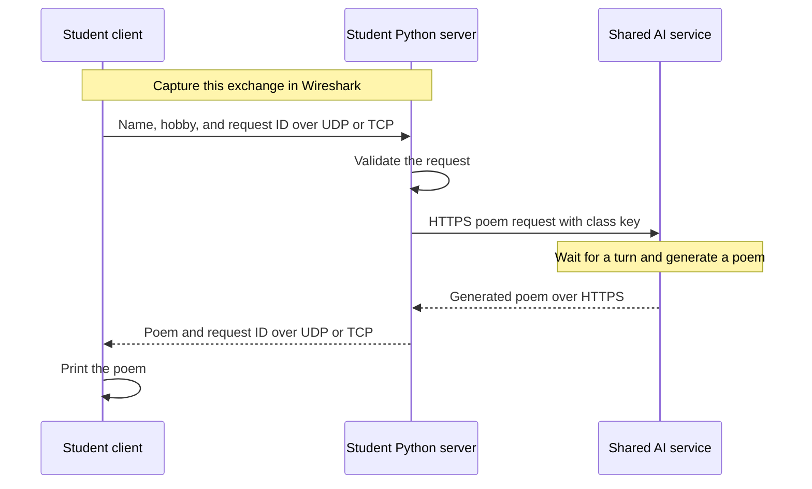

# Lab 4: Poems over TCP and UDP

In this lab, you will send your first name and hobby to a Python server and receive a short AI-generated poem. You will compare UDP and TCP traffic in Wireshark, then use Nmap to discover a partner's TCP server port.

Your Python server forwards the request to a shared language model running on the instructor's computer. You do not install a model or create a paid AI account. The poem may be awkward or inaccurate. Its literary quality is not part of the assignment.

Complete your own lab and submit your own report. Work with a partner for the port-discovery activity, taking turns as client and server.

## What you will do

| Stage | Where the programs run | Evidence to collect |
|---|---|---|
| 1. UDP exchange | Client and server on your own computer | Terminal output, UDP stream, and port numbers |
| 2. Port discovery | Your Nmap scan targets your partner’s computer | Scan command and results |
| 3. TCP exchange | Your client connects to your partner’s server | TCP stream and connection setup |

By the end, you should be able to identify socket endpoints, distinguish transport behavior from application behavior, and explain what your packet capture reveals. You will run and inspect supplied code; you do not need to write a language model.

## Before you begin

You need Python 3.9 or newer, Wireshark (including Npcap on Windows), Nmap, the class API key available in the **“Lab 4: Python Socket Scripts”** assignment in Canvas, and the Lab4 folder from this repository.

### Download and extract the lab files

**Easiest option: [Download the lab ZIP](https://github.com/maf946/IST-220-Labs/archive/refs/heads/lab4-ai-poems.zip).** No GitHub account, Git installation, or GitHub Desktop is needed.

If you prefer to download through GitHub’s menus:

1. Open the [lab repository on the `lab4-ai-poems` branch](https://github.com/maf946/IST-220-Labs/tree/lab4-ai-poems).
2. At the top of the repository’s file list, confirm that the branch selector says **`lab4-ai-poems`**. This is the version used by these instructions.
3. Click the green **Code** button, then **Download ZIP**. If the menu has tabs, select **Local** first. Use the repository page linked above; the button is not on an individual file’s page.

After the download finishes:

| Operating system | Extract the ZIP |
|---|---|
| macOS | Find the ZIP in Downloads and double-click it. If your browser already extracted it, use the resulting folder. |
| Windows | Find the ZIP in Downloads, right-click it, choose **Extract All…**, and click **Extract**. Open the extracted folder, not the ZIP’s preview. |

Open the extracted **`IST-220-Labs-lab4-ai-poems`** folder and locate **`Lab4`** inside it. The ZIP includes the whole repository; you only need the Lab4 folder for this assignment. Move the extracted folder somewhere you can find again, such as your course folder in Documents.

When you open PyCharm below, select the **extracted `Lab4` folder** as your project. Do not open the ZIP itself, download scripts one at a time, or copy code from the GitHub webpage.

Keep these files together in `Lab4`:

- `TCPClient.py`, `TCPServer.py`, `UDPClient.py`, `UDPServer.py`
- `lab4_common.py`
- `lab4_config.example.json`
- `requirements.txt`

### Install PyCharm

If PyCharm already runs Python programs on your computer, skip installation and open the lab folder below. This lab uses PyCharm’s **free core features**. The current download combines the former Community Edition and optional Pro features; you do not need to purchase a subscription or activate an AI assistant for this lab.

**macOS**

1. Visit the [official PyCharm download page](https://www.jetbrains.com/pycharm/download/) and select **macOS**.
2. Choose **Apple Silicon** for an M-series Mac, or **Intel** for an Intel Mac. Check **Apple menu → About This Mac** if unsure.
3. Open the downloaded `.dmg` and drag **PyCharm** into **Applications**.
4. Launch PyCharm from Applications and complete the first-launch prompts.

**Windows**

1. Visit the [official PyCharm download page](https://www.jetbrains.com/pycharm/download/) and select **Windows**. Use the standard x64 installer for most PCs; select ARM64 only for an ARM-based PC.
2. Run the downloaded `.exe` and follow the installer. The default options are sufficient; a desktop shortcut is optional.
3. Launch PyCharm from the Start menu and complete the first-launch prompts.

If the current release does not support your operating system, consult your instructor before choosing an older release. See JetBrains’ [installation guide and system requirements](https://www.jetbrains.com/help/pycharm/installation-guide.html).

### Open the lab and select Python

1. On PyCharm’s welcome screen, click **Open**. If another project is already open, use **File → Open**.
2. Select the extracted **Lab4 folder**, not one individual `.py` file. Open it as one project. If asked whether to trust it, confirm only after checking that it is the course-provided folder.
3. In the Project pane, confirm that all four client/server scripts and `lab4_common.py` are visible. Do not create a separate project for each script. Use matching versions on both partners’ computers.
4. Check the project’s Python interpreter. Open **PyCharm → Settings** on macOS or **File → Settings** on Windows, then search for **Python Interpreter**. Select a local Python 3.9-or-newer interpreter supported by your PyCharm version. If one is already selected and works, keep it.
5. If none is configured, choose **Add Interpreter → Add Local Interpreter** (wording can vary by version). Select an installed Python 3 interpreter, or create a virtual environment using that interpreter as its base. Accepting a project `.venv` is fine; install the certificate package into that environment using the next steps. If Python is not installed, use [python.org/downloads](https://www.python.org/downloads/) to install Python 3 for your operating system, then return to interpreter selection. PyCharm is the editor; Python is what executes your scripts.
6. Install the certificate package and finish the class-key configuration below **before starting a server**.

JetBrains provides additional help for [configuring a Python interpreter](https://www.jetbrains.com/help/pycharm/configuring-python-interpreter.html).

### Install the certificate package

The student server uses **certifi**, a bundle of trusted certificate authorities, to verify the shared AI service’s HTTPS certificate. Install it in the **same Python interpreter you selected for this project**. Keep HTTPS certificate verification enabled.

In PyCharm, open **Settings → Python Interpreter**, use the package installation control (often a **+** button), search for **certifi**, and install it. If it is already installed, update it. This method works on both Mac and Windows and targets the selected project interpreter.

Alternatively, if your project uses a `.venv` folder inside Lab4, open a terminal in Lab4 and run the matching command:

| Environment | Install command |
|---|---|
| macOS project `.venv` | `./.venv/bin/python -m pip install --upgrade -r requirements.txt` |
| Windows PowerShell project `.venv` | `& ".\.venv\Scripts\python.exe" -m pip install --upgrade -r requirements.txt` |

If your interpreter is stored somewhere else, use the PyCharm package installation method above. Installing into a different Python environment will not fix this project. If installation fails, share the error with your instructor.

### Run a server and client at the same time in PyCharm

Use **two separate Run tabs in the same project**. Start the server first and leave it running while the client sends its request. You do not need two PyCharm windows or to start all four scripts at once.

For the local UDP activity:

1. Right-click **`UDPServer.py`** in the Project pane and select **Run 'UDPServer'**. The Run tool window opens and prints the port. A server that is waiting quietly is working normally; it should not finish yet.
2. Leave that process running. Start the Wireshark capture as directed in Part 1.
3. Right-click **`UDPClient.py`** and select **Run 'UDPClient'**. Its output appears in a separate Run tab. Use the file’s right-click menu so you do not accidentally rerun the server with the toolbar’s currently selected configuration.
4. Click inside the **UDPClient** output area to type answers. Press Enter to accept `127.0.0.1`, then type the server’s printed port, your first name, and your hobby, pressing Enter after each answer. Do not type these inputs into the server tab or Python Console.
5. Switch between **UDPServer** and **UDPClient** tabs to inspect their output. The client finishes after printing the poem; the server stays available. Run the client again only when the lab asks you to make another request.
6. When finished, select the **server’s** Run tab and click its red **Stop** button. In a terminal, use Ctrl+C instead.

For TCP, follow the same pattern with **`TCPServer.py`** and **`TCPClient.py`**. During the partner activity, the server runs in your partner’s PyCharm while the client runs in yours. Keep the partner’s server running throughout the scan and poem request, then switch roles.

If PyCharm asks to stop or rerun an already-running server when you meant to start a client, **cancel** and right-click the correct client file. Restarting the server may change its port. Separate client and server configurations can run concurrently; you do not need to enable multiple copies of the same configuration. See [JetBrains’ run instructions](https://www.jetbrains.com/help/pycharm/running-applications.html).

### Alternative: two terminal tabs

The numbered lab steps below show terminal commands. You may use the equivalent right-click **Run** actions above instead; complete the same inputs and Wireshark steps.

To use terminals inside PyCharm, select **View → Tool Windows → Terminal**. Ensure it is in the Lab4 folder. Run the server in the first terminal tab, then use the terminal’s **+** button to open a second terminal session and run the client there. Leave the first tab running. A terminal occupied by a running server cannot also accept a client launch command. The same approach works with two separate operating-system terminal windows.

| Task | macOS terminal | Windows PowerShell |
|---|---|---|
| Check Python | `python3 --version` | `py -3 --version` |
| Start UDP server | `python3 UDPServer.py` | `py -3 UDPServer.py` |
| Start UDP client | `python3 UDPClient.py` | `py -3 UDPClient.py` |
| Start TCP server | `python3 TCPServer.py` | `py -3 TCPServer.py` |
| Start TCP client | `python3 TCPClient.py` | `py -3 TCPClient.py` |

Check Nmap with `nmap --version`. If Python, Nmap, or Wireshark is missing, complete your instructor’s software setup before continuing. The only additional Python package required is certifi, installed above. The numbered steps show macOS commands; use the Windows equivalents above when appropriate.

### Configure the class key

Open the **“Lab 4: Python Socket Scripts”** assignment in Canvas to find the class key.

Copy `lab4_config.example.json` to **`lab4_config.json`** in the same folder. Replace `PASTE_CLASS_KEY_HERE` in the copy with the class key from that Canvas assignment. Keep the quotation marks and the other settings. Do not include this file or the key in your report, screenshots, or Git commits. The repository ignores the local configuration file.

Use a plain-text editor for the JSON file, and make sure its name is not accidentally `lab4_config.json.txt`. Leave the URL and model alias unchanged. Everyone needs their own configured copy because everyone will take a turn running a server.

The **server** needs this configuration. The **client** does not need the key. Your computer needs Internet access when it runs a server because that server contacts the shared AI service.

## How the application works

There are **three programs** but two separate network conversations. Your Python server is a server to your student client and an HTTPS client to the shared AI service.



In Part 1, the first two programs run on your computer. In Part 3, they run on different partners’ computers. The shared AI service stays on the instructor’s computer throughout.

| Conversation | Protocol | What is sent |
|---|---|---|
| Your client ↔ your Python server | UDP or TCP, depending on the script | Name, hobby, request ID, and poem as readable JSON |
| Your Python server ↔ shared AI service | HTTPS | An authenticated poem request and the model's response |

Use the Python server’s printed port in your client. **Do not enter `ai220.m84.us` or the AI service’s internal port in the student client.** The supplied server code handles that second conversation automatically.

The first conversation is the one you will inspect in this lab. HTTPS on the second conversation does **not** encrypt the first. Use a first name and a hobby; do not send sensitive information.

Each server asks the operating system for an available port and prints that port. Restarting it may change the port. Clients prompt for the server's IPv4 address and port before asking for your name and hobby.

After sending your request, the client prints **“Request sent. Waiting for your poem...”** and explains that the shared service may take a minute or two. This means the client is waiting; it is not a confirmation that the server has received the request. Each client runs one request and exits. Servers keep running until you press **Ctrl+C**. A poem can take tens of seconds, and requests from other students can make the wait longer. Wait for either a poem or an error; the client normally times out after about two minutes without a response. Follow your instructor’s turn-taking directions and do not start extra clients while a request is pending. If a request fails, coordinate before trying again. The programs do not automatically retry.

### Choose the correct address and capture interface

| Test | Address entered in the client | Wireshark interface on the client computer |
|---|---|---|
| Client and server on your computer | `127.0.0.1` | Loopback (`lo0` on macOS; Npcap loopback adapter on Windows) |
| Client on your computer, server on a partner’s | Partner’s LAN IPv4 address | Wi-Fi or Ethernet used to reach the partner |

`127.0.0.1` always means **the computer running the client**. It will not connect to your partner. IP addresses and port numbers in the examples below are illustrative; use the values from your own session.

## Part 1: UDP on your own computer

1. Open a terminal in the Lab4 folder and run:

   ```bash
   python3 UDPServer.py
   ```

2. Record the printed port. Keep the server running.
3. In Wireshark, select the **loopback** interface: usually `lo0` on macOS, or the Npcap loopback capture adapter on Windows. Both programs will use `127.0.0.1`, so your Wi-Fi interface is not the correct interface for this test.
4. Start capturing. Enter a **display filter** in the filter bar above the packet list, then press Enter. Use your actual server port, for example:

   ```text
   udp.port == 54321
   ```

5. In a second terminal in the same folder, run:

   ```bash
   python3 UDPClient.py
   ```

6. Accept the default server address `127.0.0.1`, enter the server's port, and enter your first name and hobby. Use a short hobby phrase such as `stargazing`, `baking`, or `playing soccer` (at most 80 characters); your first name can be at most 40 characters. Press Enter after each input. Wait for the poem. Keep the output visible for your screenshot.
7. Stop capturing and save the capture as `Lab4-UDP.pcapng` so you can revisit it. Right-click the request packet, then choose **Follow → UDP Stream**. Select a readable text view such as UTF-8. The JSON request contains `name`, `hobby`, and `request_id`. The response contains the same request ID and a `poem`. Newlines inside a JSON string appear as `\n`; this is expected.
8. Examine the UDP headers of the request and response. Record both source and destination IP addresses and ports. Notice how the endpoints reverse direction. You may need to close the stream window and expand **Internet Protocol Version 4** and **User Datagram Protocol** in the packet details.

   Use a small table in your notes:

   | Direction | Source IP | Source port | Destination IP | Destination port |
   |---|---|---|---|---|
   | Request | | | | |
   | Response | | | | |

   The two IP addresses can be identical in a loopback capture. Use the ports and message contents to distinguish the programs.

**Question 1.** Include screenshots showing the UDP server's port and your client's inputs and poem. Explain which program is the client, which is the server, and why the client must know the server's address and port.

**Question 2.** Include a Follow UDP Stream screenshot showing your request and response. Include your endpoint table with the source and destination IP addresses and ports in each direction. Explain what the request ID does at the application layer, and why receiving this response does not mean UDP guarantees delivery. Can someone capturing this client–server traffic read your name and hobby? Support your answer with your capture.

Stop the UDP server with Ctrl+C when finished.

## Part 2: Find a partner's TCP port

Only scan your consenting partner's computer and the port range shared for this activity. Do not scan other devices or wider ranges.

1. Decide who will run the server first. The server partner runs:

   ```bash
   python3 TCPServer.py
   ```

2. The server partner checks the printed **Suggested LAN IP** against their active Wi-Fi or Ethernet connection, then shares their **LAN IPv4 address** and a block of at most 100 ports containing the printed server port. Do not reveal the exact port yet. For example, if the port is `54637`, share `54600–54699`. For a port near the top of the range, use `65500–65535`; no port exceeds 65535.

   If the suggested address is `127.0.0.1`, or belongs to a different interface such as a VPN, ask your instructor to help identify the reachable LAN address. Do not share a public Internet address for this scan.

3. The client partner runs Nmap against that one address and range, substituting the actual values:

   ```bash
   nmap --unprivileged -sT -Pn -n -p 54600-54699 192.168.1.25
   ```

   `-sT` requests a TCP connect scan; it does not require an administrator terminal. `-Pn` skips host discovery, and `-n` skips name resolution. The range after `-p` limits the scan.

4. Identify the open port and check it with your partner. An Nmap service label is a guess based on port conventions; it does not establish what this Python application does. If multiple ports are open, have the server partner identify the lab port.
5. Keep the server running. Do not restart it between discovery and the next part. An Nmap connection does not include a poem request, so the server should not generate a poem during the scan.

**Question 3.** Provide your partner's name and course email, the exact Nmap command you ran, and a screenshot of its output. Identify the lab server's port and explain what Nmap's `open` result tells you. Explain why you cannot discover this TCP listener by scanning only UDP ports.

### If the partner connection is blocked

Being on the same Wi-Fi network does not guarantee that devices can reach each other. Check the LAN address and any prompt asking whether Python may accept incoming connections. Do not disable your firewall wholesale. If campus isolation or another restriction prevents the connection, ask your instructor to approve the fallback: run the TCP server locally and scan its announced range at `127.0.0.1`. Document the attempted partner test, the problem, and the approved fallback in your report.

## Part 3: Capture the TCP poem conversation

1. On the client computer, select the interface used to reach your partner: normally Wi-Fi or Ethernet. Use loopback only for the approved same-computer fallback.
2. Start a **new capture** after the Nmap scan so the scan's connections do not clutter your application capture. Apply a filter using the actual server port:

   ```text
   tcp.port == 54637
   ```

3. Run the client:

   ```bash
   python3 TCPClient.py
   ```

4. Enter your partner's LAN IPv4 address and the discovered port, followed by your name and hobby. Wait for the response, then stop capturing and save it as `Lab4-TCP.pcapng`.
5. Select a packet in this connection and choose **Follow → TCP Stream**. Inspect the JSON request and poem. Close the stream window while keeping the selected stream filter to examine the packets in that connection.
6. Find the connection's SYN, SYN/ACK, and ACK packets. Locate the application data and examine how the connection closes. Packet counts and the placement of acknowledgments can vary; do not expect one fixed number of packets.
7. Open `UDPClient.py`, `UDPServer.py`, `TCPClient.py`, and `TCPServer.py` in PyCharm. Start at `main()` in each file and follow the numbered comments for socket creation, sending, and receiving. The TCP scripts also define `receive_line()` for complete-message handling. Then read the UDP and TCP sections of [SocketScriptsOverview.md](SocketScriptsOverview.md). Use them to connect your packet observations to how the supplied code identifies a complete message.
8. Switch roles and repeat Parts 2 and 3 so both partners run a client, discover a port, and capture their own exchange. The new server will print its own port; do not reuse the previous partner’s port automatically. After both partners have their evidence, stop your student server with Ctrl+C.

**Question 4.** Include a Follow TCP Stream screenshot showing your poem exchange and a packet-list screenshot showing the connection setup. In one or two paragraphs, compare this exchange with UDP: connection setup, delivery and ordering, and how the application knows it has a complete message. Explain why a long wait for a poem is not, by itself, evidence of packet loss. Use observations from your captures.

## Submit

Submit one report with labeled answers to Questions 1–4. Before submitting, check that it includes:

- **Q1:** UDP server and client output, including your name, hobby, and returned poem, plus your explanation of the two roles.
- **Q2:** UDP stream screenshot, endpoint table, and explanations about request IDs, delivery, and readability.
- **Q3:** Partner information, exact Nmap command, scan screenshot, and your interpretation (or the documented instructor-approved fallback).
- **Q4:** TCP stream and handshake screenshots, plus your TCP/UDP comparison and explanation of the wait for a poem.

Screenshots must be readable and should show only the relevant application windows or packet details. Keep your `.pcapng` files for reference; include them in the submission only if your instructor asks. Do not submit the class key or `lab4_config.json`. Follow your instructor’s directions for report format and due date.

## Troubleshooting

| Symptom | What to check |
|---|---|
| Missing configuration or rejected class key | Check the local filename, JSON syntax, and key in the **“Lab 4: Python Socket Scripts”** assignment in Canvas. Never paste the key into a help screenshot. |
| Client still asks for a major, or reports a missing hobby | Obtain the current Lab4 folder on both computers and restart the server. The current version asks for a hobby. |
| PyCharm says no interpreter is configured | Select a local Python interpreter in Settings as described above. |
| Typing does not answer the client’s prompts | Click the client’s Run output area; do not type in the server tab or Python Console. |
| Starting the client stops the server | Cancel any rerun prompt, then right-click the client file and select its Run action. |
| Python cannot find the script or `lab4_common` | Open the terminal in Lab4 and keep all supplied Python files together. |
| Missing certifi or certificate verification failed | Install or update certifi in the project interpreter, then restart the server. If verification still fails, contact your instructor. |
| HTTP 403 | Check that you have the current supplied code, then report the error to your instructor. |
| No matching packets | Check the capture interface, current server port, and whether capture started before running the client. |
| Connection refused | Check that the correct server is still running and that you used its current port. |
| Timeout, HTTP 503, or gateway error | The model may be loading or busy. Tell your instructor; avoid repeatedly submitting requests. |
| Nmap shows filtered ports | Check the address, network isolation, and firewall permissions with your instructor. |
| Server port changed | Use the port printed by the current server process; update the client input and Wireshark filter. |
| Poem has the wrong number of lines or odd wording | That is acceptable. The lab examines networking behavior, not model quality. |

For details about the code, see [SocketScriptsOverview.md](SocketScriptsOverview.md).
