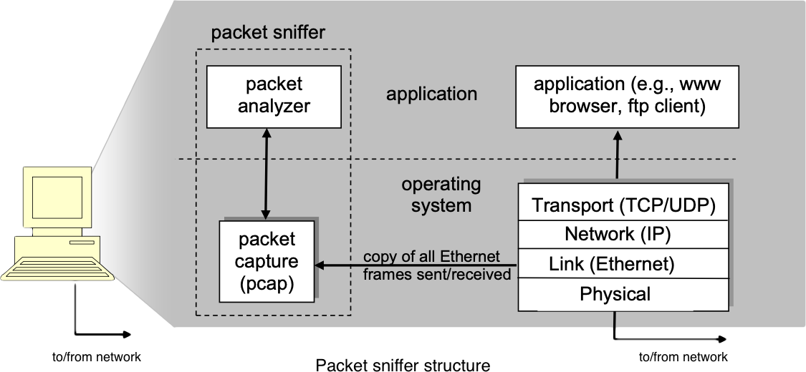
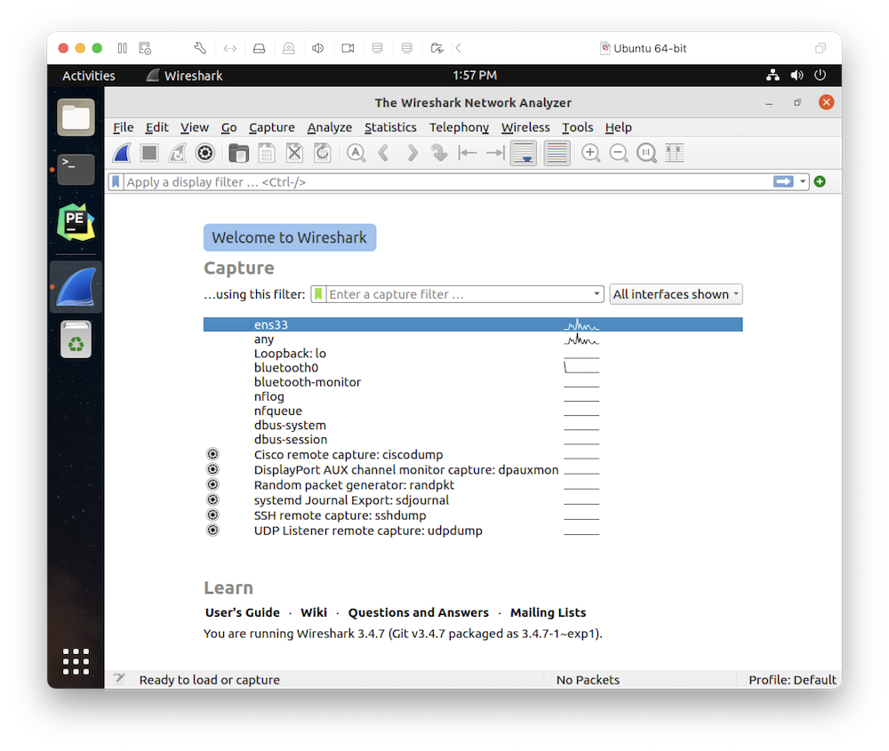
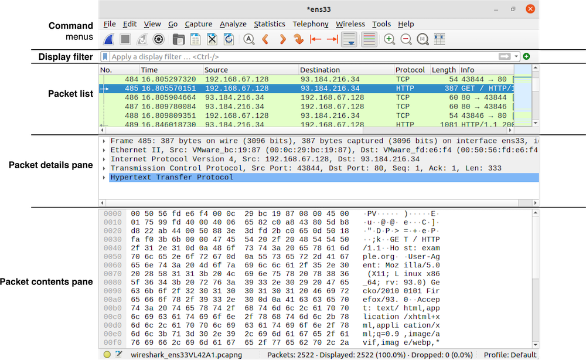

# Wireshark: Getting Started

One's understanding of network protocols can often be greatly deepened by "seeing protocols in action" and by "playing around with protocols"—observing the sequence of messages exchanged between two protocol entities, delving down into the details of protocol operation, and causing protocols to perform certain actions and then observing these actions and their consequences. This can be done in simulated scenarios or in a "real" network environment such as the Internet. In the Wireshark labs you'll be doing in this course, you'll be running various network applications in different scenarios using your own computer (or you can borrow a friends; let me know if you don't have access to a computer where you can install/run Wireshark). You'll observe the network protocols in your computer "in action," interacting and exchanging messages with protocol entities executing elsewhere in the Internet. Thus, you and your computer will be an integral part of these "live" labs. You'll observe, and you'll learn, by doing.

In this first Wireshark lab, you'll get acquainted with Wireshark, and make some simple packet captures and observations.

The basic tool for observing the messages exchanged between executing protocol entities is called a **packet sniffer**. As the name suggests, a packet sniffer captures ("sniffs") messages being sent/received from/by your computer; it will also typically store and/or display the contents of the various protocol fields in these captured messages. A packet sniffer itself is passive. It observes messages being sent and received by applications and protocols running on your computer, but never sends packets itself. Similarly, received packets are never explicitly addressed to the packet sniffer. Instead, a packet sniffer receives a copy of packets that are sent/received from/by application and protocols executing on your machine.

The image below shows the structure of a packet sniffer. On the right are the protocols (in this case, Internet protocols) and applications (such as a Web browser or FTP client) that normally run on your computer. The packet sniffer, shown within the dashed rectangle, is an addition to the usual software in your computer, and consists of two parts. The **packet capture library** receives a copy of every link-layer frame that is sent from or received by your computer. Messages exchanged by higher layer protocols such as HTTP, FTP, TCP, UDP, DNS, or IP all are eventually encapsulated in link-layer frames that are transmitted over physical media such as an Ethernet cable. In the image below, the assumed physical media is an Ethernet cable, and so all upper-layer protocols are eventually encapsulated within an Ethernet frame. Capturing all link-layer frames thus gives you all messages sent/received from/by all protocols and applications executing in your computer.

The second component of a packet sniffer is the **packet analyzer**, which displays the contents of all fields within a protocol message. In order to do so, the packet analyzer must “understand” the structure of all messages exchanged by protocols. For example, suppose we are interested in displaying the various fields in messages exchanged by the HTTP protocol in the image above. The packet analyzer understands the format of Ethernet frames, and so can identify the IP datagram within an Ethernet frame. It also understands the IP datagram format, so that it can extract the TCP segment within the IP datagram. Finally, it understands the TCP segment structure, so it can extract the HTTP message contained in the TCP segment. Finally, it understands the HTTP protocol and so, for example, knows that the first bytes of an HTTP message will contain the string “GET,” “POST,” or “HEAD.” 

We will be using the [Wireshark packet sniffer](http://www.wireshark.org/) for these labs, allowing us to display the contents of messages being sent/received from/by protocols at different levels of the protocol stack. (Technically speaking, Wireshark is a packet analyzer that uses a packet capture library in your computer). Wireshark is a free network protocol analyzer that runs on Windows, Mac, and Linux/Unix computers. It’s an ideal packet analyzer for our labs–it is stable, has a large user base and well-documented support that includes a [user guide](http://www.wireshark.org/docs/wsug_html_chunked/), [man pages](http://www.wireshark.org/docs/man-pages/), and a [detailed FAQ](http://www.wireshark.org/faq.html), rich functionality that includes the capability to analyze hundreds of protocols, and a well-designed user interface. It operates in computers using Ethernet, serial (PPP and SLIP), 802.11 wireless LANs, and many other link-layer technologies (if the OS on which it's running allows Wireshark to do so).

## Getting Wireshark

Download and install Wireshark by accessing the [Download Wireshark](https://www.wireshark.org/download.html) page.

## Running Wireshark

When you run the Wireshark program, you’ll get a startup screen that looks something like the screen below.

On your machine, double-click the appropriate interface to start capturing (it will likely be labeled "Wi-Fi: " at the beginning). A screen like the one below will be displayed, showing information about the packets being captured. Once you start packet capture, you can stop it by using the Capture pull-down menu and selecting Stop, or by clicking the red fin icon.

The Wireshark interface has five major components:

* The **command menus** are standard pulldown menus located at the top of the window. Of interest to us now are the File and Capture menus. The File menu allows you to save captured packet data or open a file containing previously captured packet data, and exit the Wireshark application. The Capture menu allows you to begin packet capture.

* The **packet list** displays a one-line summary for each packet captured, including the packet number (assigned by Wireshark; this is not a packet number contained in any protocol’s header), the time at which the packet was captured, the packet’s source and destination addresses, the protocol type, and protocol-specific information contained in the packet. The packet listing can be sorted according to any of these categories by clicking on a column name. The protocol type field lists the highest-level protocol that sent or received this packet, i.e., the protocol that is the source or ultimate sink for this packet.

* The **packet details pane** provides details about the packet selected (highlighted) in the packet-listing window. (To select a packet in the packet list, place the cursor over the packet’s one-line summary in the packet-listing window and click with the left mouse button.). These details include information about the Ethernet frame (assuming the packet was sent/received over an Ethernet interface) and IP datagram that contains this packet. The amount of Ethernet and IP-layer detail displayed can be expanded or minimized by clicking on the plus minus boxes to the left of the Ethernet frame or IP datagram line in the packet details window. If the packet has been carried over TCP or UDP, TCP or UDP details will also be displayed, which can similarly be expanded or minimized. Finally, details about the highest-level protocol that sent or received this packet are also provided.

* The **packet contents pane** displays the entire contents of the captured frame, in both ASCII and hexadecimal format.

* Towards the top of the Wireshark graphical user interface, is the **display filter** field, into which a protocol name or other information can be entered in order to filter the information displayed in the packet-listing window (and hence the packet-header and packet-contents windows). 
